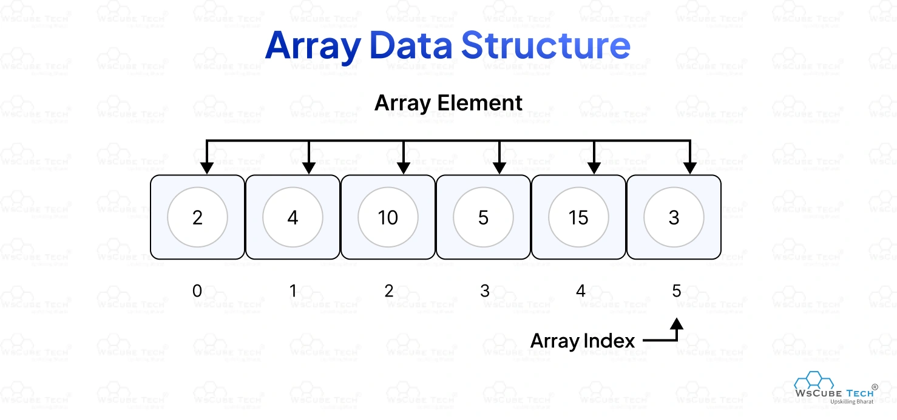

### caractéristiques 
1 - can store elements of different data types

2 - elements are stored in continuous memory locations 

3 - each element has a unique index

4 - arrays length automatically grow or shrink as you add or remove elements.

### types
1 - Unidimensional or Regular Array

  [1, 2, 3, 4]
  
  [1, 'v', "hello"]

2 - Multidimensional Array 
 
  [ ["X", "O", "X"],
    ["O", "X", "O"],
    ["O", "O", "X"] ]

  
  [ ['c', "O", 1],
    ["O", "O"],
    ["O", 1.5, "X", true] ]

3 - Typed Array : used for binary value

  Int8Array for values between  -128 and 127
  
  Uint8Array for values between  0 and 255
  
  Uint16Array for values between 0 and 65535
  
  Int32Array for values between -2147483648 and 2147483647
  
  Uint32Array for values between 0 and 4294967295
  and many more ...

### Built-in methods

43 methods are available for the array serving different purpose
run the file arrays.js for a full explanatory using : node arrays.js

