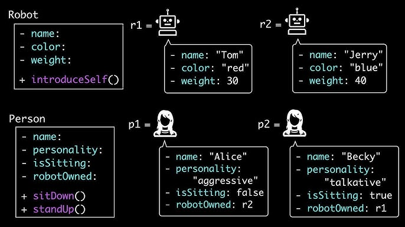

### caractéristiques 
1- Data is stored as keys (strings or symbols) mapped to values. A value can be any data type, including primitives, other objects, or functions.

2- JavaScript objects are mutable by default. You can add, modify, or delete properties and methods at any time after the object is created.

3- Objects are stored and copied by reference, not by value. If you assign an object to a new variable, both variables point to the exact same memory location.

### built-in methods

28 methods are available for the object serving different purpose

run the file objects.js for a full explanatory using : node objects.js
