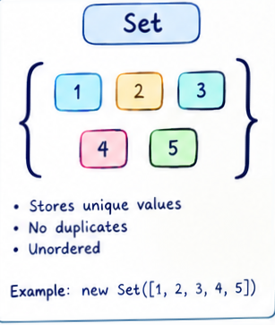
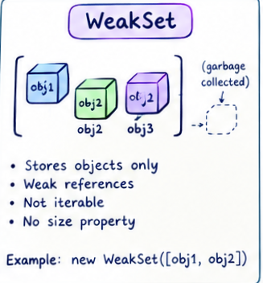

  
### caractéristiques 
1- a set can hold values of different data types but the values are unique and cannot store duplicate value

2- they can grow and shrink dynamically as you add or remove value you don't have to declare the size before using them

3- Elements in a Set are iterated in insertion order. The first element added is the first one visited during a loop.

### built-in methods
