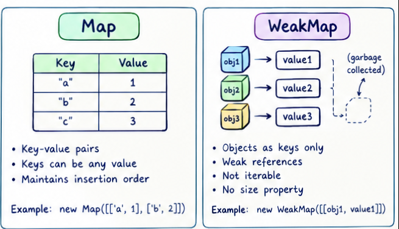

### caractéristiques 
1- Key-value pairs with unique keys — Map objects are collections of key-value pairs, where a key may only occur once since it is unique in the Map's collection. 
mozilla

2- Any value can be a key — the Map object holds key-value pairs and remembers the original insertion order of the keys, and any value, both objects and primitive values, may be used as either a key or a value. This is unlike plain objects, whose keys are limited to strings and symbols. 
mozilla

3- Insertion-order iteration — a Map object is iterated by key-value pairs, where a for...of loop returns a 2-member array of [key, value] for each iteration, and this iteration happens in insertion order, corresponding to when each pair was first inserted via set(). 

4- Map-vs-Object comparison, a Map contains no keys by default (only what's explicitly inserted), whereas an Object has a prototype that brings in default keys that can accidentally collide with your own; this also makes a Map safer to use with user-supplied keys, since setting user-supplied key/value pairs directly on an Object can enable prototype-pollution style attacks.

### built-in methods

11  methods are available for the map serving different purpose
run the file maps.js for a full explanatory using : node maps.js
