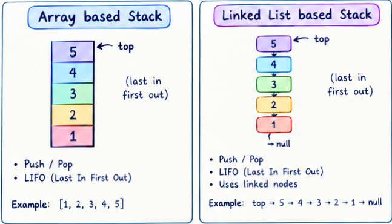

# JavaScript does not have a built-in Stack class, but you can easily implement one using an Array or a Linked List.

### caractéristiques 
1- LIFO Structure it means that The most recently added item is always at the top and must be processed first.

2- Restricted Access it means that You can only add or remove elements from one end, known as the top of the stack. You cannot access elements in the middle or bottom without removing the elements above them.

3- Stacks can grow or shrink dynamically as elements are added or removed

### Built-in methods

Since the stack is not a built in datathpe in JavaScript it is more ruled by the implémentation of the class interface you implement .

6 core methods are available for the stack serving different purpose
run the file stacks.js for a full explanatory using : node stacks.js
