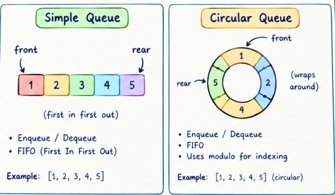
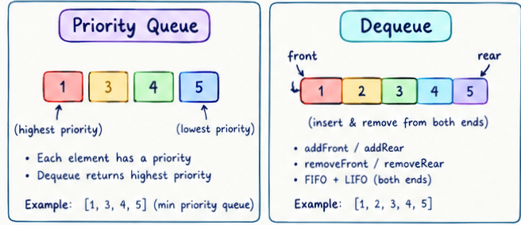

### caractéristiques 
1- FIFO ordering — a queue is a collection in which entities are kept in order, and the principal operations are adding entities to the rear (enqueue) and removing them from the front (dequeue), making it a First-In-First-Out structure, so the first element added is the first one removed.

2- Only two access points — insertion always happens at one end (the rear/back) and removal always happens at the other end (the front/head); unlike an array, you don't read or modify arbitrary positions in the middle.

3- Three basic operations — a basic queue supports enqueue (add to the rear), dequeue (remove and return the item at the front), and peek (look at the front item without removing it).

4- Implementation-agnostic — a queue is an abstract data type, not tied to one underlying structure; it can be built on an array, a linked list, or a circular buffer, and the choice affects performance (e.g. Array.shift() in JS is O(n) because every remaining element has to be re-indexed, which is why a linked-list-backed queue is often preferred for frequent dequeues)

### built-in methods 
