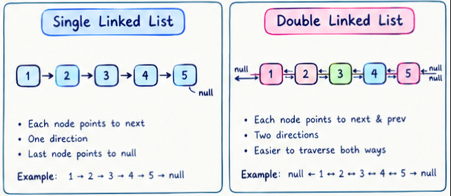
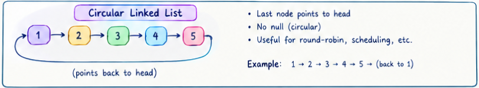

### caractéristiques 
1- Nodes linked by pointers, not memory position — a linked list is a linear collection of data elements called nodes, each pointing to the next node by means of a pointer, where linear order is not given by physical placement in memory; instead, each element points to the next.

2- Each node holds data + a reference — under the simplest form, each node is composed of data and a reference (a link) to the next node in the sequence, so traversal means hopping from node to node by following the pointers rather than jumping to an index.

3- Dynamic size, non-contiguous memory — unlike arrays, linked lists can grow and shrink dynamically as elements are added or removed, and nodes may not be stored in contiguous memory locations, allowing more flexible memory usage.

4- Fast insert/delete, slow random access — inserting or deleting a node can be done efficiently, in constant time, if the position is already known, since it only involves changing pointers rather than shifting elements — but reaching a specific node still requires walking the list from the head, so lookups are linear-time rather than instant like an array index

### built-in methods 
JavaScript has no built-in LinkedList — all three variants single , double and circular are patterns you build with plain objects/classes.

run the file linkedlists.js for a full explanatory using : node linkedlists.js
